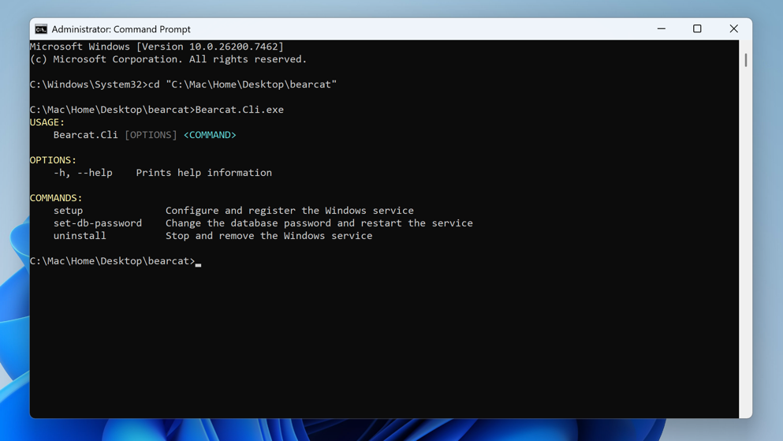
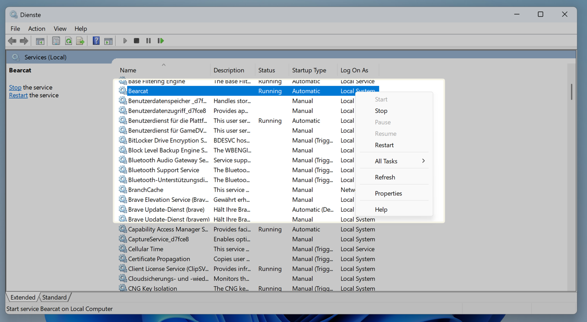
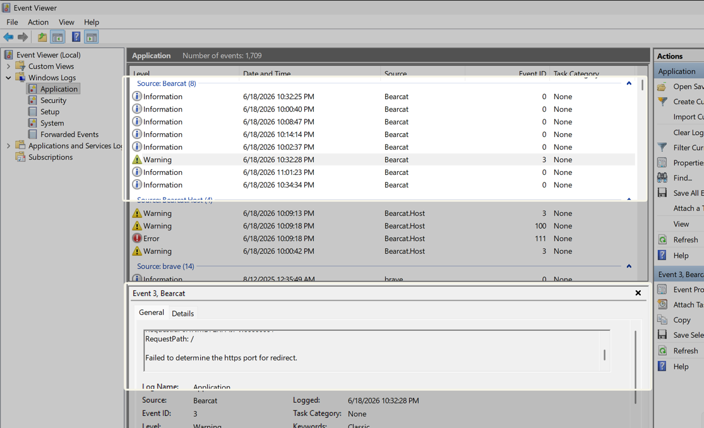
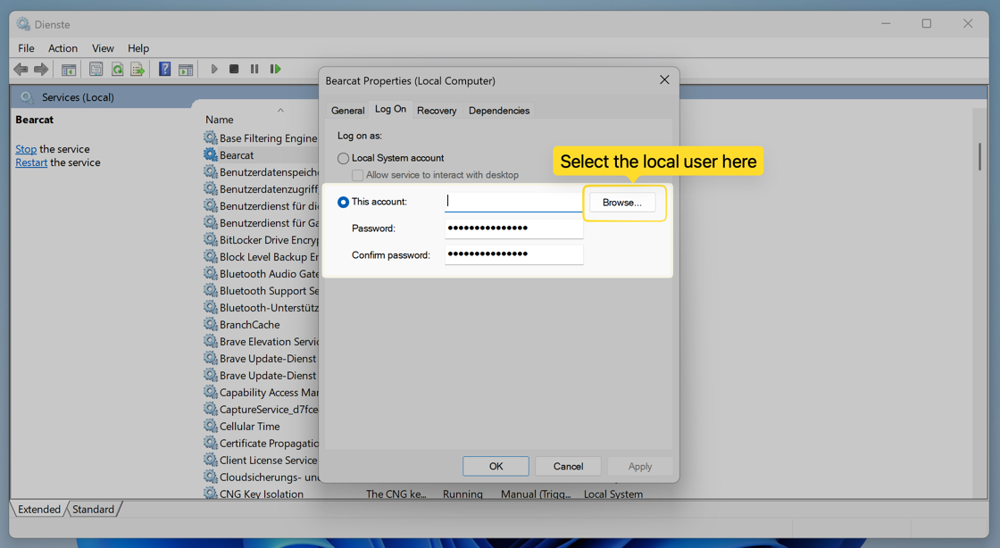

Bearcat is a web application that runs in your browser. Running it as a Windows service lets it start automatically with the machine and keep running in the background, even when no user is logged in.

This is the recommended setup if you want Bearcat to be **always on**: on a Windows Server, or on a Windows PC where you want it running permanently. If you'd rather start and stop Bearcat by hand when you need it, use the [Desktop app](/Bearcat/use-the-desktop-launcher/) instead. Both run the exact same Bearcat, so you can switch later without losing data.

The service uses YOUR OWN PostgreSQL server. It does not ship with PostgreSQL. For PostgreSQL setup instructions, see [Installing PostgreSQL For The Desktop App](/Bearcat/install-postgresql-for-desktop/).

## Requirements

- PostgreSQL 18 running locally or on a reachable machine
- RAR command line executable (on Windows this comes with WinRAR)
- 7z command line executable
- A release data directory the service can read and write
- An Administrator terminal to run the setup

## Downloading

Get the latest Windows Service package from the [GitHub releases page](https://github.com/gizmo93/Bearcat/releases) and extract it to a folder of your choice, for example `C:\Program Files\Bearcat`.

The folder contains both `Bearcat.Host.exe` (the application that runs as the service) and `Bearcat.Cli.exe` (the small command line tool you use to install and manage it).

## Installing

Open a terminal **as Administrator** (right-click => Run as administrator), change into the Bearcat folder, and run:

```text
Bearcat.Cli.exe setup
```



The setup asks you for:

- **7z executable** – full path, or empty to use `PATH`
- **rar executable** – full path, or empty to use `PATH`
- **Release data directory** – where Bearcat looks for your release files
- **Database host / port / name / user / password** – your PostgreSQL connection
- **Web port** – the local HTTP port for the web UI (default `17208`)

It then tests the database connection, writes the configuration file, registers and starts the `Bearcat` Windows service, and waits until the service reports healthy.

When it's done, Bearcat is reachable at:

```text
http://127.0.0.1:<web-port>
```

Re-running `setup` later is safe: if the service already exists it keeps the registration (including any account you set, see below) and just applies the new configuration.

## Where The Configuration is stored

The setup writes a single machine-wide configuration file:

```text
%ProgramData%\Bearcat\config.json
```

It holds the database connection string, the 7z/RAR paths, the release data directory, and the web port. The folder's access is restricted to the service account and Administrators, because the file contains the database password in plain text.

The encryption key for stored hoster, link crypter, and NFO database account configurations is created next to it on first start:

```text
%ProgramData%\Bearcat\bearcat.key
```

Back up `bearcat.key` together with your PostgreSQL database. Without it, Bearcat cannot decrypt your stored account configurations anymore.

## Managing The Service

The service is registered under the name **Bearcat**. You can manage it like any other Windows service:

- Through the **Services** app (`services.msc`)


- Or from an Administrator terminal:

```text
sc start Bearcat
sc stop Bearcat
sc query Bearcat
```

It is set to start automatically and to restart itself if it crashes.

## Checking The Logs

The service logs to the Windows **Event Log**. Open the **Event Viewer**, go to **Windows Logs => Application**, and filter by the source **Bearcat**.



## Logging More

By default Bearcat only logs warnings and errors. If you need more detail to track down a problem, add a `Logging` section to `config.json` and restart the service. The file is layered on top of the built-in settings, so you only need to add what you want to change:

```json
{
  "Database": { "ConnectionString": "..." },
  "Archivers": { "RarPath": "...", "SevenZipPath": "..." },
  "ReleaseDataDirectory": "...",
  "Urls": "http://127.0.0.1:17208",
  "Logging": {
    "LogLevel": {
      "Default": "Information",
      "Bearcat": "Debug"
    }
  }
}
```

Then restart the service so it picks up the change:

```text
sc stop Bearcat
sc start Bearcat
```

Note: re-running `Bearcat.Cli.exe setup` rewrites `config.json` and would drop a manually added `Logging` section, so re-add it after a setup run if you need it.

## Using A Network Share For Releases

The service runs as `LocalSystem` by default, which cannot reach a protected network share, and mapped drive letters (like `Z:`) are not visible to services at all. If your release data lives on a network share:

1. Enter it as a **UNC path** (`\\server\share\releases`) during setup, not a mapped drive letter.
2. Open `services.msc` => **Bearcat** => **Log On**, and set an account that has access to the share.

3. Restart the service.

The setup reminds you about this when it detects a UNC path. The account you set here is preserved when you re-run `setup`.

## Changing The Database Password

If your PostgreSQL password changes, you don't need to edit `config.json` by hand. Run (as Administrator):

```text
Bearcat.Cli.exe set-db-password
```

It prompts for the new password, tests the connection, updates the configuration, and restarts the service.

## Updating

Bearcat updates are a simple file swap, because your configuration and encryption key live outside the install folder:

1. Stop the service: `sc stop Bearcat` (the running `.exe` and its DLLs are locked while it runs).
2. Replace the contents of the install folder with the new release. Replace the whole folder, not just `Bearcat.Host.exe`, so all files match the new version.
3. Start the service: `sc start Bearcat`.

`config.json` and `bearcat.key` in `%ProgramData%\Bearcat` are untouched, and the service registration and run-as account stay as they were. Database migrations run automatically on start, so back up your database before a major update.

## Uninstalling

To stop and remove the service, run (as Administrator):

```text
Bearcat.Cli.exe uninstall
```

It removes the Windows service and offers to delete `config.json`. Your PostgreSQL database is never touched.
